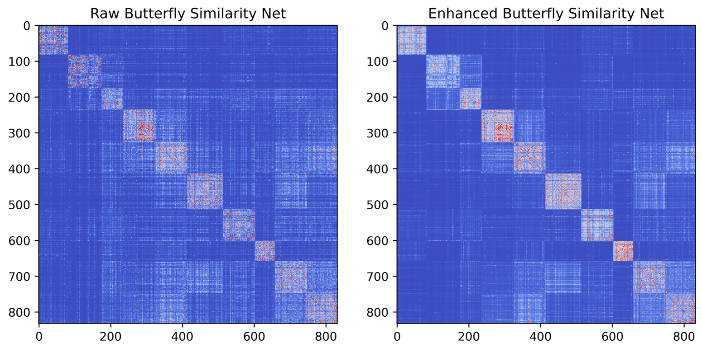
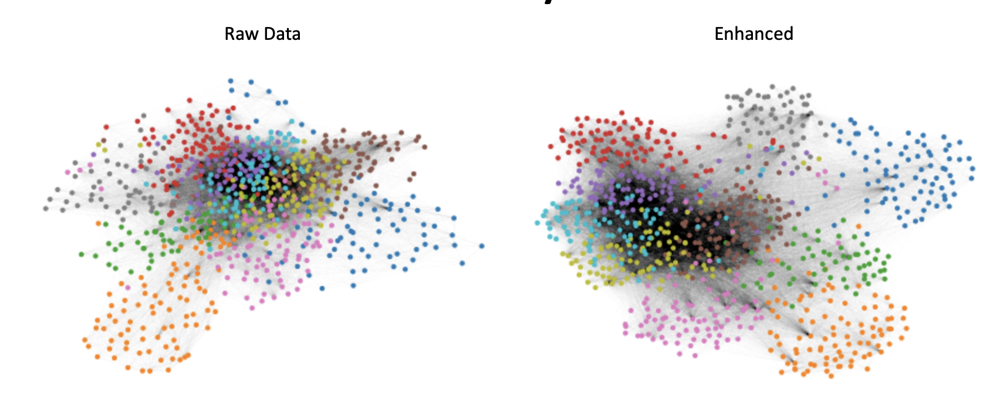
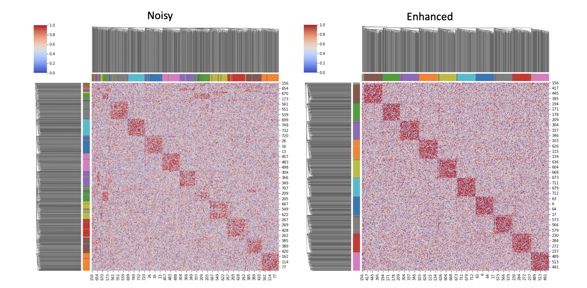

# network_enahncement_pytorch
Network Enhancement implementation in pytorch

[Research paper](https://doi.org/10.1038/s41467-018-05469-x)

Network Enhancement: a general method to denoise weighted biological networks
==============================================================================

Project website: [http://snap.stanford.edu/ne](http://snap.stanford.edu/ne).

Overview
--------

Networks are abundant in many areas of biology. These networks often entail non-trivial 
topological features and patterns critical to understanding interactions within the 
natural system. However, networks observed in real-world are typically noisy. The presence 
of high levels of noise can hamper discovery of structures and dynamics present in the network. 

We propose *Network Enhancement (NE),* a novel method for improving the 
signal-to-noise ratio of a symmetric networks and thereby facilitating the downstream network 
analysis. NE leverages the transitive edges of a network by exploiting local structures to 
strengthen the signal within clusters and weaken the signal between clusters. At the same time 
NE also alleviates the corrupted links in the network by imposing a normalization that removes 
weak edges by enforcing sparsity. NE is supported by theoretical justifications for its 
convergence and performance in improving community detection outcomes. 

The method provides theoretical guarantees as well as excellent empirical performance on 
many biological problems. The approach can be incorporated into any weighted network analysis 
pipeline and can lead to improved downstream analysis. 

Butterfly Similarity Networks
--------

Random Partition Graph
--------

